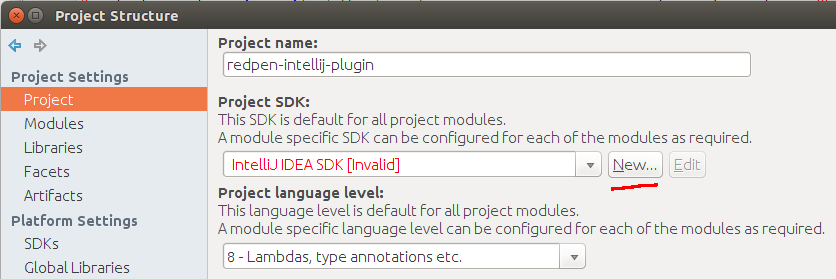
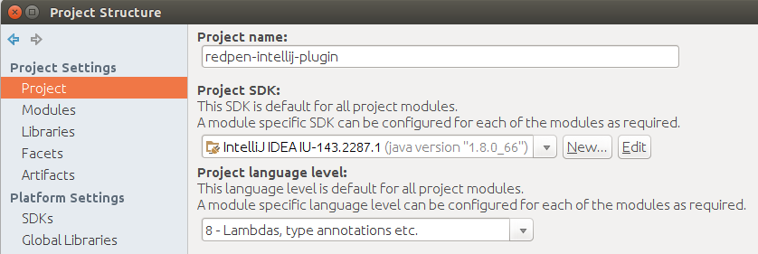

# RedPen plugin for Intellij IDEA and other JetBrains IDEs

## About

This plugin integrates [RedPen](http://redpen.cc) text validation into IDEA and other Intellij products by adding a new RedPen inspection.

### Features

* Validates text with RedPen as you type
* Supports Plain Text, Markdown and AsciiDoc file formats (make sure the relevant plugins are also installed)
* Validation error messages can be listed by pressing *Ctrl+Alt+Shift+R* or via menu *Analyze -> RedPen: List Errors*.
* RedPen configuration can be modified in Settings -> Editor -> RedPen
* Supports all default RedPen languages and variants (English, Japanese)
* Language and variant are autodetected for each file and can be manually overridden per file via status bar widget
* Settings are stored per project under *.idea/redpen* directory, so can be shared with fellow developers
* Custom dictionaries can be put to *.idea/redpen* directory and JavaScriptValidator scripts can be put to *.idea/redpen/js*. 

## Installation

The plugin is available in the official [JetBrains Plugin Repository](https://plugins.jetbrains.com/plugin/8210).

Open *Settings -> Plugins -> Browse Repository*, and search for "RedPen".

## For developers [](https://travis-ci.org/redpen-cc/redpen-intellij-plugin)

### Setup Intellij IDEA
The steps you need to perform to run/debug the project:

1. **Fetch dependencies**. For the project to compile you need to fetch dependencies into *lib* directory: ```ant deps```

2. **Setup Intellij Platform SDK.** Open this directory as a project in IntelliJ IDEA and setup *Intellij Platform SDK* for the project via
*Project Structure -> Project Settings -> Project -> Project SDK*. If valid Intellij IDEA SDK is missing from the list,
then press *New... -> Intellij Platform Plugin SDK*, choose IDEA installation path and Java version 1.8.




3. **Run configuration "Plugin".**
New instance of IDEA will start in a sandbox with the plugin activated, where you can create a dummy project for testing
or open any existing project, which contains plain text or other supported files. Note: if you are testing
other types of files that need additional plugins (e.g. markdown), then install the corresponding plugin again
in the sandboxed IDEA.

### Command-line
To build the plugin on command-line you will still need libs from a copy of Intellij IDEA.

You can download the necessary files from the latest IDEA Community Edition into *idea* subdirectory:

  ```ant download-idea```

Then you can buld the plugin and run the unit tests:

  ```ant all```

To publish the current build to *JetBrains Plugin Repository*, set environment variables *$JETBRAINS_USER* and *$JETBRAINS_PWD*, then:

  ```ant publish```
  
Publishing is done by [Travis](https://travis-ci.org/redpen-cc/redpen-intellij-plugin) on every successful build.
The repository normally accepts new releases only if plugin version in *META-INF/plugin.xml* has changed.

Please update *META-INF/plugin.xml* with the new version and change-notes for every release.
